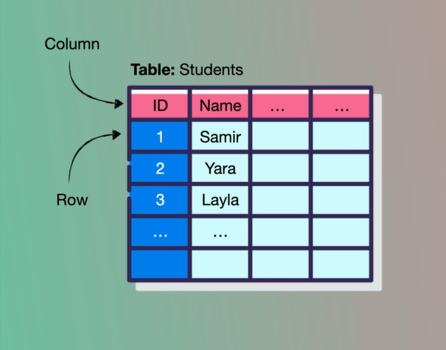
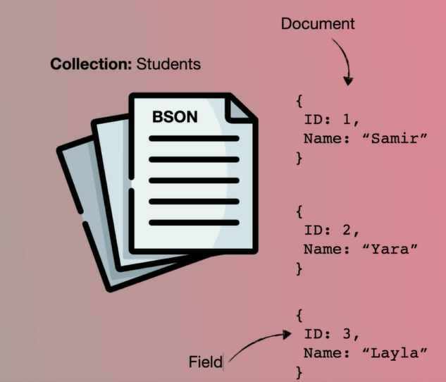
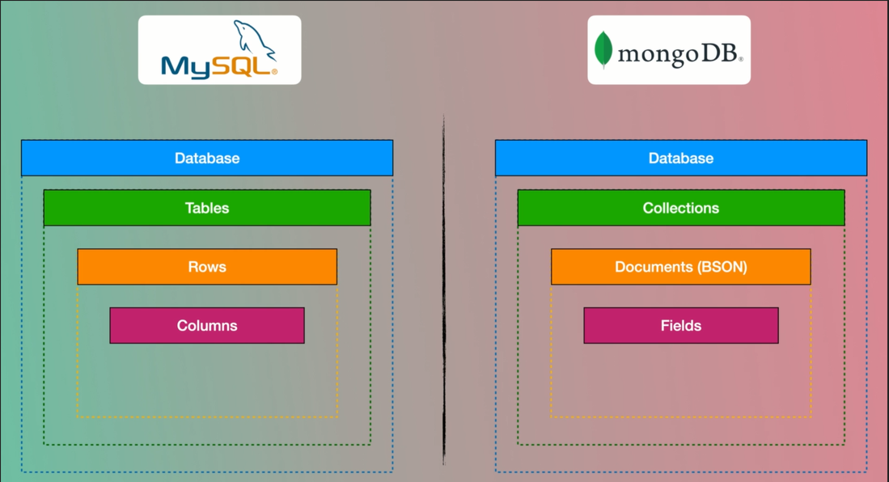

# SQL VS NOSQL  

SQL databases are primarily called as Relational Databases (RDBMS); whereas NoSQL database are primarily called as non-relational or distributed database.  

SQL databases are table based databases whereas NoSQL databases are document based, key-value pairs, graph databases or wide-column stores. This means that SQL databases represent data in form of tables which consists of n number of rows of data whereas NoSQL databases are the collection of key-value pair, documents, graph databases or wide-column stores which do not have standard schema definitions which it needs to adhered to.  

   
  

SQL databases have predefined schema whereas NoSQL databases have dynamic schema for unstructured data.

SQL databases are vertically scalable whereas the NoSQL databases are horizontally scalable. SQL databases are scaled by increasing the horse-power of the hardware. NoSQL databases are scaled by increasing the databases servers in the pool of resources to reduce the load.  

SQL databases uses SQL ( structured query language ) for defining and manipulating the data, which is very powerful. In NoSQL database, queries are focused on collection of documents. Sometimes it is also called as UnQL (Unstructured Query Language). The syntax of using UnQL varies from database to database.  

SQL database examples: MySql, Oracle, Sqlite, Postgres and MS-SQL. NoSQL database examples: MongoDB, BigTable, Redis, RavenDb, Cassandra, Hbase, Neo4j and CouchDb.  

For complex queries: SQL databases are good fit for the complex query intensive environment whereas NoSQL databases are not good fit for complex queries. On a high-level, NoSQL don’t have standard interfaces to perform complex queries, and the queries themselves in NoSQL are not as powerful as SQL query language.  

  

# What are the advantages of TDD approach?

1. Better program design and higher code quality. ...
2. Detailed project documentation.   
3. TDD reduces the time required for project development.  
4. Code flexibility and easier maintenance.   
5. With TDD you will get a reliable solution.   
6. Save project costs in the long run.  

# What is Jest beforeEach?
> beforeEach(fn, timeout)
> ***Runs a function before each of the tests in this file runs. If the function returns a promise or is a generator, Jest waits for that promise to resolve before running the test. ... // Jest will wait for this promise to resolve before running tests***  

# What is one downside of Test Driven Development?

> ***Probably, the strongest argument against TDD is that the tests need to be maintained because the code has got to. Whenever requirements change, you would like to vary the code and tests. ... So, actually, this disadvantage is that the same as before when writing code that apparently takes an extended time.***  

Trem| Def
---|-------------
functional programming|   Its a process of building software by composing pure functions, avoiding shared state, mutable data, and side-effects. 
object-oriented programming (OOP) | programming paradigm that relies on the concept of classes and objects. 
class |Its defines the variables and methoed common to all object of certain kind.
super| It refers to the parent class. It is used to call the constructor of the parent class and to access the parent's properties and methods.
this| It refers to the object it belongs to,also it can Pass an argument in the constructor call
Test Driven Development (TDD)| Its a style of programming in three activities=> 1. coding, 2. testing , 3. design 
Jest | Its testing Framework with a focus on simplicity,also It allows you to write tests with an approachable.
Continuous Integration (CI)| Its  merging all developers working copies to a shared mainline several times a day.
REST |Its a software architectural style which uses a subset of HTTP. 
Data Model | Its model that organizes elements of data and standardizes how they relate to one another .  

<!-- | Header 1  | Header 2 |
| --------  | -------- |
| data      | Some long data that   spans multiple lines | -->

